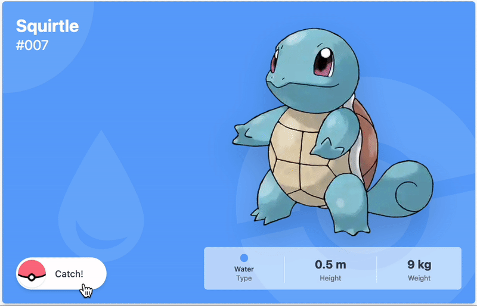

# Pokemon Awesome

## Pokemon Data

All Pokemon data used in this project comes from [PokeAPI GraphQL Beta](https://pokeapi.co/docs/graphql).  
Playground: https://beta.pokeapi.co/graphql/console/

All Pokemon images (artwork) comes from https://github.com/PokeAPI/sprites

## Getting Started

1. Install dependencies using `yarn install`.
2. Prepare environment variables (`.env.local`), refer to [`.env.example`](./.env.example) file.
3. Prepare data using `yarn prepare-data`.
4. Run development server using `yarn dev`.

For production, use this script: `yarn build && yarn start`

## Quality Check

- Prettier check: `yarn format`
- ESLint check: `yarn lint`
- TypeScript check: `yarn lint:types`
- End-to-end test check: `yarn test:e2e`

## Misc.

This project is using [Next.js [TypeScript] + Tailwind CSS Starter Template](https://github.com/afiiif/nextjs-ts-starter-template).  
The starter template contains:

- ⚡️ [Next.js 12](https://nextjs.org/)
- ⚛️ [React 18](https://reactjs.org/)
- 🎐 [Tailwind CSS 3](https://tailwindcss.com/)
- 🪄 [Prettier](https://prettier.io/) — Format your code automatically, this will also run **on save**
- 🧼 [ESLint](https://eslint.org/) — Find & fix problems in your code, and **auto sort** your imports
- 🐶 [Husky](https://www.npmjs.com/package/husky) & [Lint Staged](https://www.npmjs.com/package/lint-staged) — Check & fix code when commit, block commit if bad code detected
- 📜 [Commit Lint](https://github.com/conventional-changelog/commitlint) — Make sure the commit message follows the conventional commit
- ⚙️ [Github Actions](https://github.com/features/actions) — Check your code on push & pull-request
- 🤖 [Dependabot](https://github.com/dependabot) — Create pull-request to update your dependencies
- 🔗 [Absolute Import](./tsconfig.json) — Import modules using `@/` prefix
- 💟 [React Icons](https://react-icons.github.io/react-icons/) — Include popular icons in your React projects easily
- 🌟 [React Power-Ups](https://github.com/afiiif/react-power-ups) — Collection of React hooks to speed-up your app development
